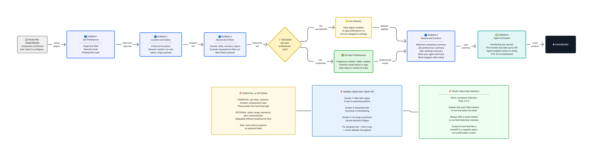
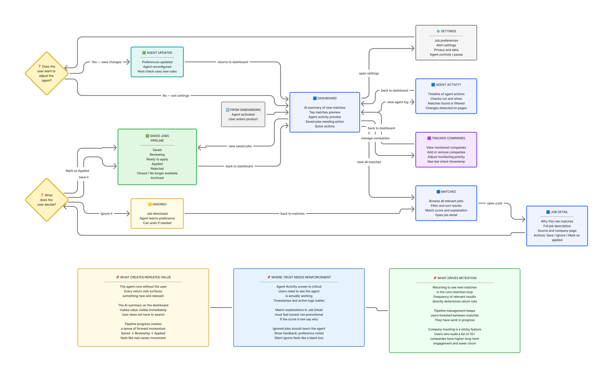
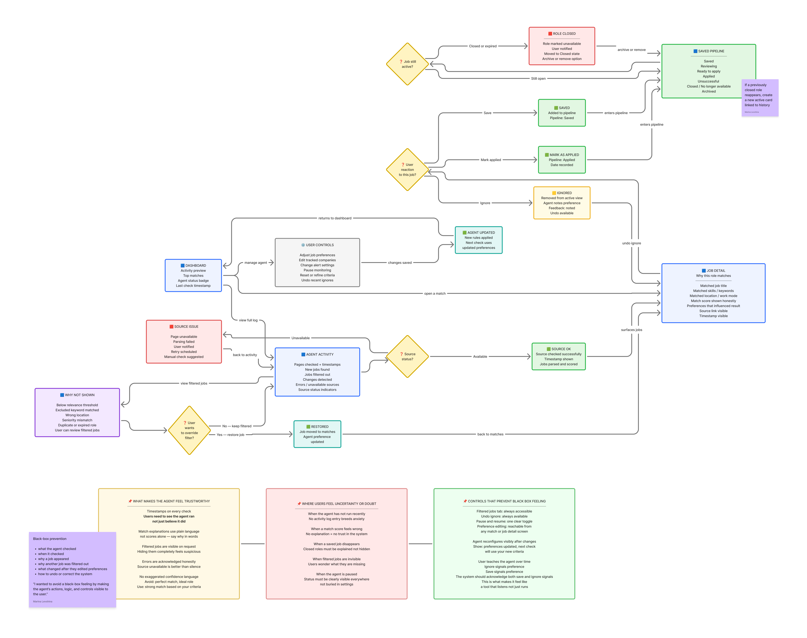

# JobRadar — Agent-Powered SaaS for Job Seekers

JobRadar is an agent-powered SaaS prototype that monitors selected company career pages and surfaces relevant roles privately.

It explores agent UX, explainability, and decision-support workflows for a calmer, faster, and more private job-search experience.

---

## Overview

JobRadar started as a product exploration around a simple question:

**What would a calmer, more private, more focused job search look like if an agent handled the repetitive monitoring work?**

Instead of searching the whole internet, users choose the companies they want to work for. The agent monitors those career pages, finds relevant roles, sends notifications, explains why they match, and helps users decide what to save, ignore, or apply to.

The project combines:
- product strategy
- UX structure
- trust and explainability design
- interactive front-end prototyping
- lightweight local agent simulation

This case study documents the concept, the problem framing, the product logic, the UX flows, and the prototype layers built so far.

---

## Product Concept

JobRadar is a job-tracking tool for people targeting specific employers.

Instead of searching the whole internet, users choose the companies they want to work for. The agent monitors those career pages, finds relevant roles, sends notifications, explains why they match, and helps users decide what to save, ignore, or apply to.

> Pick your dream companies. Set your preferences. Let the agent watch the boring part.

This creates a job-search workflow that is:
- more focused
- more private
- less noisy
- easier to understand
- easier to act on

---

## Problem

Job searching is noisy, repetitive, and emotionally exhausting.

Users are often buried under irrelevant listings, excessive alerts, recruiter spam, and public job-search signals that can feel risky or exposing.

For employed professionals, privacy matters just as much as speed. They may be open to better opportunities, but do not want to rely on public “Open to Work” visibility.

Meanwhile, technical automation tools can help, but usually require setup skills that many users do not have.

JobRadar explores a simpler alternative: a company-first job-tracking workflow for users who want a calmer and more focused search process.

---

## Why This Product

Three product opportunities became clear:

### 1. Reduce noise
Most job platforms optimize for volume. JobRadar instead optimizes for relevance.

### 2. Protect privacy
Users can monitor opportunities without publicly signaling they are job searching.

### 3. Lower the technical barrier
Many useful automation workflows already exist, but they are still too technical for most users. JobRadar explores the same value in a more accessible form.

---

## Who It Is For

JobRadar is for:

- active job seekers tired of LinkedIn noise
- people who want to apply early to selected companies
- employed professionals who want privacy while exploring opportunities
- users who want a calmer, more focused job-search workflow

---

## Core User Flow

1. Pick your target companies  
2. Set your preferences  
3. Let the agent monitor them  
4. Review only relevant roles  
5. Save, ignore, or apply faster  

---

## Product Principles

The product was shaped around a few principles:

### Company-first, not internet-first
The core model is not “search everything.”  
It is “monitor the employers I care about.”

### The agent should reduce work, not create confusion
The product should feel supportive and transparent, not magical or vague.

### Trust must be built deliberately
Users need to understand:
- what the agent checked
- what it found
- why a role appeared
- why another role was filtered out
- what they can control

### The UI should support decisions
The dashboard is not only a status surface. It is a decision-support surface.

---

## Dashboard Preview

The dashboard is designed to answer three questions quickly:

- what happened
- what matters now
- what should I do next

This became one of the central organizing principles for the product.

---

## Interactive Prototypes

All current prototypes are standalone HTML files with no backend, API, or setup required.

### Pre-onboarding
[Launch pre-onboarding prototype](https://lievshynam-source.github.io/JobRadar.-Agent-Powered-SaaS-for-Job-Seekers/jobradar-pre-onboarding.html)

### Onboarding
[Launch onboarding prototype](https://lievshynam-source.github.io/JobRadar.-Agent-Powered-SaaS-for-Job-Seekers/jobradar-onboarding-v2.html)

### Dashboard
[Launch dashboard prototype](https://lievshynam-source.github.io/JobRadar.-Agent-Powered-SaaS-for-Job-Seekers/jobradar-dashboard-v2.html)

### Local Agent Simulator
[Launch local agent simulator](https://lievshynam-source.github.io/JobRadar.-Agent-Powered-SaaS-for-Job-Seekers/jobradar-agent/jobradar-agent.html)

---

## Product Flows

The first product layer focused on structure and behavior before visual polish.

### Pre-Onboarding Flow
Helps users understand the product promise before setup — and routes them into the right path based on whether they already know which companies to track.

### Onboarding Flow
Collects companies, preferences, keywords, alerts, and review confirmation. Designed as a way for the user to teach the agent what to watch for.

### Main App Flow
Defines the core SaaS navigation and user actions across all product screens.

### Agent Activity / Trust Flow
Shows what the agent checked, found, filtered, or failed to access — and how trust is built through transparency and control.

### Dashboard Flow
Turns agent results into clear states and next actions.

---

## Flow Reasoning

Each flow solved a different product question.

### Pre-onboarding
Clarified what the product is and what it is not.  
This was important because JobRadar is not a traditional job board.

### Onboarding
Turned setup into “teaching the agent,” not just filling forms.

### Main App Flow
Defined the core navigation and the working loop between dashboard, matches, job detail, and saved roles.

### Agent Activity / Trust Flow
Prevented the product from feeling like a black box.  
This flow made the agent visible and understandable.

### Dashboard Flow
Translated agent behavior into states, priorities, and next actions.

Together, these flows created the product logic before UI polish started.

---

## Prototype Layers

JobRadar was developed in layers, from product logic to coded prototype.

### 1. Onboarding Prototype
Explores how users configure the agent:

- target companies
- preferred roles
- location
- seniority
- keywords
- alert preferences
- review before first scan

The goal was to make setup feel guided, calm, and understandable.

### 2. Dashboard Prototype
Explores the core SaaS experience after setup:

- AI summary
- top matches
- saved jobs / pipeline
- tracked companies
- agent activity
- source status
- dashboard states

This layer focused on hierarchy, actionability, and trust.

### 3. Local Agent Simulator
A lightweight front-end simulation that makes the product logic testable before building a real backend.

It currently simulates:

- company source checks
- deterministic job scoring
- match explanations
- filtered jobs
- source errors
- activity logs
- dashboard state updates
- save / ignore feedback

This turned the prototype from a static UI into a small simulated system.

---

## Local Agent Simulator

The local agent simulator was built to make the product behavior testable without backend complexity.

It is not yet a real AI agent.  
It is a deterministic front-end simulation.

### What it does
- reads local company, job, and preference data
- simulates company monitoring
- scores jobs against user preferences
- generates plain-language match explanations
- updates dashboard state
- simulates source failures
- supports save / ignore actions

### Why this matters
This made it possible to validate:
- trust patterns
- dashboard states
- match logic
- filtered-result logic
- activity feedback
- interaction loops

before implementing any production infrastructure.

---

## Trust and Explainability

One of the core goals of JobRadar is avoiding a black-box agent experience.

The product should never feel like:
- mysterious
- overconfident
- unaccountable
- impossible to correct

That led to several explicit design choices:

- visible activity history
- visible source status
- reason strings for matches
- filtered-out jobs explained, not hidden
- clear state changes
- save / ignore controls
- user correction as part of the workflow

The trust layer is not a secondary feature.  
It is part of the core product experience.

---

## What the Dashboard Tries to Do

The dashboard is not just a summary page.

It is designed to:
- show proof the agent is active
- make changes visible
- prioritize next actions
- maintain trust
- help users move from discovery to decision

That is why the dashboard was structured around:

1. what happened  
2. what matters now  
3. what should I do next  

This helped define both the information hierarchy and the states.

---

## Prototype States

The product currently explores several dashboard states:

- warming up / first run
- strong matches found
- no new matches
- jobs need action
- source issues
- filtered or weak results

These states matter because the product should still feel useful even when there are no exciting new results.

That was especially important in the onboarding-to-dashboard transition.

---

## Human–AI triad

| Role | Contribution |
|---|---|
| **Maryna Lievshyna** | Product Design Lead, product vision, UX direction, final decisions |
| **ChatGPT** | Product logic support, UX structure, case study framing |
| **Claude + Cursor** | UI iteration, front-end prototyping, interactive prototype support |

This project was built through a Human–AI triad workflow simulating early product collaboration across product logic, UX structure, UI iteration, and code-backed prototyping.

I led the vision, made the final decisions, and used AI tools as product, design, and engineering support.

---

## What Is Real vs. Simulated

### Real
- product concept
- UX flows
- information architecture
- SaaS dashboard structure
- onboarding logic
- trust and explainability patterns
- interactive HTML prototypes
- local JSON data structure
- deterministic scoring logic
- dashboard states
- save / ignore interactions

### Simulated
- real career-page scraping
- real AI / LLM reasoning
- backend infrastructure
- user accounts
- persistent database
- live notifications
- live job availability

This prototype is designed to prove the product experience, not production readiness.

---

## Repository Contents

- `jobradar-pre-onboarding.html` — pre-onboarding prototype
- `jobradar-onboarding-v2.html` — onboarding prototype
- `jobradar-dashboard-v2.html` — dashboard prototype
- `jobradar-agent/jobradar-agent.html` — local agent simulator
- `jobradar-agent/data-companies.json` — sample company sources
- `jobradar-agent/data-jobs.json` — sample job listings
- `jobradar-agent/data-userPreferences.json` — sample user preferences
- `README.md` — concise project overview
- `CASE_STUDY.md` — extended product reasoning, flows, and prototype documentation

---

## Next Steps

### Prototype improvements
- visual consistency pass across all dashboard states
- ignore feedback affecting similar job scores on the next run
- force source error button for demo control
- new-since-last-visit badge on matches

### Real product exploration
- Greenhouse and Lever JSON API integration
- n8n automation for daily digest alerts
- Playwright fallback for custom career pages without an ATS

### Longer-term product direction
- user accounts and persistent preferences
- company suggestion engine based on role and location criteria
