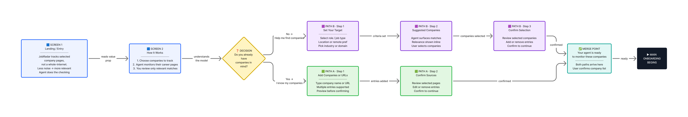

# JobRadar — Agent-Powered SaaS for Job Seekers

JobRadar is an agent-powered SaaS prototype that monitors selected company career pages and surfaces relevant roles privately.

It explores agent UX, explainability, and decision-support workflows for a calmer, faster, and more private job-search experience.

---

## Product Concept

JobRadar is a job-tracking tool for people targeting specific employers.

Instead of searching the whole internet, users choose the companies they want to work for. The agent monitors those career pages, finds relevant roles, sends notifications, explains why they match, and helps users decide what to save, ignore, or apply to.

> Pick your dream companies. Set your preferences. Let the agent watch the boring part.

---

## Problem

Job searching is noisy, repetitive, and emotionally exhausting.

Users are often buried under irrelevant listings, excessive alerts, recruiter spam, and public job-search signals that can feel risky or exposing.

For employed professionals, privacy matters just as much as speed. They may be open to better opportunities, but do not want to rely on public “Open to Work” visibility.

Meanwhile, technical automation tools can help, but usually require setup skills that many users do not have.

JobRadar explores a simpler alternative: a private, company-first job-tracking workflow for non-technical users.

---

## Who It Is For

JobRadar is for:

- active job seekers tired of LinkedIn noise
- people who want to apply early to selected companies
- employed professionals who want privacy while exploring opportunities
- users who want a calmer, more focused job-search workflow

---

## Core User Flow

1. Pick your target companies  
2. Set your preferences  
3. Let the agent monitor them  
4. Review only relevant roles  
5. Save, ignore, or apply faster  

---

## Dashboard Preview

The dashboard is designed to answer three questions quickly:

- what happened
- what matters now
- what should I do next

---

## Interactive Prototypes

All current prototypes are standalone HTML files with no backend, API, or setup required.

### Pre-onboarding
[Launch pre-onboarding prototype](https://lievshynam-source.github.io/JobRadar.-Agent-Powered-SaaS-for-Job-Seekers/jobradar-pre-onboarding.html)

### Onboarding
[Launch onboarding prototype](https://lievshynam-source.github.io/JobRadar.-Agent-Powered-SaaS-for-Job-Seekers/jobradar-onboarding.html)

### Dashboard
[Launch dashboard prototype](https://lievshynam-source.github.io/JobRadar.-Agent-Powered-SaaS-for-Job-Seekers/jobradar-dashboard.html)

### Local Agent Simulator
[Launch local agent simulator](https://lievshynam-source.github.io/JobRadar.-Agent-Powered-SaaS-for-Job-Seekers/jobradar-agent.html)

---

## Product Flows

The first product layer focused on structure and behavior before visual polish.

### Pre-onboarding
Helps users understand the product promise before setup.

### Dashboard Flow
Turns agent results into clear states and next actions.

More detailed flow documentation is available in [CASE_STUDY.md](./CASE_STUDY.md).

---

## Prototype Layers

JobRadar was developed in layers, from product logic to coded prototype.

### 1. Onboarding Prototype
Explores how users configure the agent:
- target companies
- preferred roles
- location
- seniority
- keywords
- alert preferences
- review before first scan

### 2. Dashboard Prototype
Explores the core SaaS experience after setup:
- AI summary
- top matches
- saved jobs / pipeline
- tracked companies
- agent activity
- source status
- dashboard states

### 3. Local Agent Simulator
A lightweight front-end simulation that makes the product logic testable before building a real backend.

It currently simulates:
- company source checks
- deterministic job scoring
- match explanations
- filtered jobs
- source errors
- activity logs
- dashboard state updates
- save / ignore feedback

---

## Human–AI triad

| Role | Contribution |
|---|---|
| **Maryna Lievshyna** | Product Design Lead, product vision, UX direction, final decisions |
| **ChatGPT** | Product logic support, UX structure, case study framing |
| **Claude + Cursor** | UI iteration, front-end prototyping, interactive prototype support |

This project was built through a Human–AI triad workflow simulating early product collaboration across product logic, UX structure, UI iteration, and code-backed prototyping.

I led the vision, made the final decisions, and used AI tools as product, design, and engineering support.

---

## What Is Real vs. Simulated

### Real
- product concept
- UX flows
- information architecture
- SaaS dashboard structure
- onboarding logic
- trust and explainability patterns
- interactive HTML prototypes
- local JSON data structure
- deterministic scoring logic
- dashboard states
- save / ignore interactions

### Simulated
- real career-page scraping
- real AI / LLM reasoning
- backend infrastructure
- user accounts
- persistent database
- live notifications
- live job availability

This prototype is designed to prove the product experience, not production readiness.

---

## Repository Contents

- `jobradar-pre-onboarding.html` — pre-onboarding prototype
- `jobradar-onboarding.html` — onboarding prototype
- `jobradar-dashboard.html` — dashboard prototype
- `jobradar-agent.html` — local agent simulator
- `data-companies.json` — sample company sources
- `data-jobs.json` — sample job listings
- `data-userPreferences.json` — sample user preferences
- `CASE_STUDY.md` — extended product reasoning, flows, and prototype documentation

---

## Next Steps

Planned next steps include:
- stronger visual polish
- deeper matches and job-detail refinement
- more realistic company/source behavior
- expanded agent logic
- backend-backed MVP exploration
